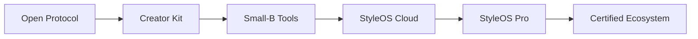

# StyleOS Protocol

StyleOS Protocol is an open protocol for AI-powered personal styling workflows.

StyleOS 是 ruhang365 发起的 AI 个人造型决策开放标准，帮助造型、穿搭、形象创作者构建可复用的服务工具。

## What is StyleOS

StyleOS is not a consumer color test, a photo retouching tool, or an offline store management system.

StyleOS Protocol is an open protocol for turning personal styling expertise into structured, repeatable, product-ready workflows. It helps creators describe user inputs, style tags, rule cards, lite reports, and evaluation criteria in a shared format.

中文说明：
StyleOS Protocol 不是 C 端色彩测试工具，不是修图工具，也不是线下门店系统。它是一套开放协议，用来把个人造型经验结构化、产品化、工具化，让造型、穿搭、形象服务可以被复用、交付和持续优化。

## Who is it for

- styling creators
- outfit creators
- image consultants
- hairstylists
- makeup artists
- photography studios
- AI product builders
- small beauty / styling businesses

中文使用者：

- 造型博主
- 穿搭博主
- 形象顾问
- 发型师
- 化妆师
- 摄影 / 妆造机构
- AI 产品开发者
- 小型美业 / 形象服务商家

## What this repository includes

- [Input Schema](docs/input-schema.md): fan profile, scenario, photo metadata, goals, constraints, budget, and creator notes.
- [Style Tag Schema](docs/style-tag-schema.md): shared tags for face shape, facial proportion, hairstyle, color, outfit, makeup, scenario, and creator-specific extensions.
- [Rule Card Schema](docs/rule-card-schema.md): reusable styling rule format for recommendations and avoid lists.
- [Report Schema](docs/report-schema.md): lite report output structure for creator delivery.
- [Creator Kit](creator-kit/README.md): practical templates for creators and small service teams.
- [Lite Report Template](creator-kit/report-lite-template.md): copy-ready report format.
- [Synthetic Examples](examples/synthetic-case-001.md): synthetic reference cases and outputs.
- [Evaluation Framework](docs/evaluation-framework.md): quality criteria for rule cards, reports, and schema changes.
- [Seed Knowledge Pack](modules/README.md): starter modules, rule cards, synthetic cases, validation, and execution cards.

## What this repository does NOT include

- StyleOS Cloud
- StyleOS Pro
- expert model library
- commercial styling knowledge base
- verified case database
- creator studio
- certified partner system
- ruhang365 / StyleOS trademarks and brand assets

## Seed Knowledge Pack

v0.1.1 adds a seed knowledge pack so the repository is more than empty schemas. It includes starter modules, starter rule cards, synthetic cases, validation documents, and execution card templates.

The current seed rules are starter content for protocol demonstration and community iteration. They are not expert-certified recommendations.

中文说明：
当前种子规则用于协议演示和社区共创，不代表专家认证结论，不代表科学定论，也不代表数据验证结果。

## Current Modules

- [Hairstyle](modules/hairstyle/README.md): face-shape tags, hair attributes, hairstyle goals, mapping matrix, and barber brief.
- [Color](modules/color/README.md): undertone tendency, brightness, saturation, contrast, scenario color, and color mapping.
- [Outfit](modules/outfit/README.md): silhouette, fabric, neckline, shoulder line, waistline, length, formality, scenario, and personal brand goals.
- [Makeup](modules/makeup/README.md): skin finish, eyebrow direction, eye emphasis, cheek placement, lip color direction, and camera look.
- [Accessories](modules/accessories/README.md): glasses, hats, earrings, necklaces, bags, and accessory visual weight.
- [Scenario](modules/scenario/README.md): daily commute, client meeting, interview, date, content creation, livestream, photoshoot, wedding guest, and public speaking.

## Starter Rule Cards

The v0.1.1 seed pack includes 35 starter / unverified Rule Cards:

- [12 hairstyle rules](modules/hairstyle/hairstyle-rule-index.md)
- [6 color rules](modules/color/color-rule-index.md)
- [6 outfit rules](modules/outfit/outfit-rule-index.md)
- [4 makeup rules](modules/makeup/makeup-rule-index.md)
- [3 accessories rules](modules/accessories/accessories-rule-index.md)
- [4 scenario rules](modules/scenario/scenario-rule-index.md)

Each rule includes applicable conditions, recommendations, avoid notes, scenario, confidence level, evidence level, review status, execution notes, limitations, and privacy note.

## Synthetic Cases

The seed pack includes [8 synthetic cases](cases/README.md) covering hairstyle, color, outfit, makeup, accessories, client meeting, and creator content scenarios.

All cases are synthetic. They do not include real users, real photos, real names, real contacts, real creators, or private service records.

## Evidence Levels

StyleOS uses [Evidence Levels](validation/evidence-levels.md) to prevent starter content from being misread as verified knowledge:

- E0 Synthetic starter rule
- E1 Community submitted rule
- E2 Repeated creator observation
- E3 Expert reviewed rule
- E4 Data-validated rule
- E5 Pro model validated pattern

Most v0.1.1 seed rules are E0.

## Important Disclaimer

StyleOS Protocol provides open schemas, templates, starter rules, and synthetic examples. It does not provide medical advice, body modification advice, cosmetic surgery advice, or deterministic judgments about appearance.

中文说明：
本仓库避免外貌羞辱、身体羞辱、性别刻板印象和绝对化判断。所有 starter rules 都需要创作者人工复核，并根据真实场景、用户目标、维护意愿和隐私授权谨慎使用。

## Architecture



The open-source layer spreads the protocol, schemas, templates, and community reference materials.

开源层负责标准传播，包括协议、Schema、Lite templates、Creator Kit 和 synthetic examples。

The commercial layer is responsible for hosted products, advanced libraries, certification, and data feedback loops.

商业层负责线上产品、高级库、认证体系和数据闭环。

## Repository Structure

```text
.
├── README.md
├── CHANGELOG.md
├── ROADMAP.md
├── COMMERCIAL.md
├── TRADEMARKS.md
├── DATA_POLICY.md
├── CONTRIBUTOR_TERMS.md
├── CONTRIBUTING.md
├── PRIVACY.md
├── SECURITY.md
├── docs/
│   ├── overview.md
│   ├── open-core-boundary.md
│   ├── input-schema.md
│   ├── style-tag-schema.md
│   ├── rule-card-schema.md
│   ├── report-schema.md
│   └── evaluation-framework.md
├── creator-kit/
│   ├── README.md
│   ├── fan-intake-form.md
│   ├── service-menu-template.md
│   ├── report-lite-template.md
│   └── creator-workflow.md
├── modules/
│   ├── hairstyle/
│   ├── color/
│   ├── outfit/
│   ├── makeup/
│   ├── accessories/
│   └── scenario/
├── rules/
│   ├── hairstyle/
│   ├── color/
│   ├── outfit/
│   ├── makeup/
│   ├── accessories/
│   └── scenario/
├── cases/
├── validation/
├── execution-cards/
├── examples/
│   ├── synthetic-case-001.md
│   ├── synthetic-rule-card-001.md
│   └── synthetic-report-lite-001.md
└── .github/
    ├── ISSUE_TEMPLATE/
    │   ├── rule-card.yml
    │   ├── schema-suggestion.yml
    │   └── creator-use-case.yml
    └── pull_request_template.md
```

- `docs/`: protocol overview, schema references, open-core boundary, and evaluation framework.
- `creator-kit/`: practical templates for creators to collect inputs, package services, deliver lite reports, and improve rules.
- `modules/`: modular starter knowledge structure.
- `rules/`: starter / unverified Rule Cards.
- `cases/`: synthetic cases only.
- `validation/`: evidence levels, rule status, and review process.
- `execution-cards/`: practical brief templates for barber, shopping, makeup, outfit, and photoshoot workflows.
- `examples/`: synthetic examples only. Do not submit real user photos, names, contacts, or private data.
- `.github/`: issue forms and pull request checklist for community contribution.

## Quick Start for Creators

1. Read [Fan Intake Form](creator-kit/fan-intake-form.md) to collect structured fan information.
2. Use [Service Menu Template](creator-kit/service-menu-template.md) to package your service options.
3. Generate a lite report with [Report Lite Template](creator-kit/report-lite-template.md).
4. Follow [Creator Workflow](creator-kit/creator-workflow.md) to review, deliver, collect feedback, and abstract reusable rule improvements.
5. Submit rule cards through GitHub Issues using the `Rule Card` template.

中文说明：
造型 / 穿搭 / 形象博主可以先用资料采集表收集粉丝信息，再用服务菜单定义交付范围，最后用轻量报告模板输出建议。沉淀出的稳定经验可以用 Rule Card 形式提交到社区。

## Quick Start for Developers

1. Read [Input Schema](docs/input-schema.md).
2. Read [Style Tag Schema](docs/style-tag-schema.md).
3. Read [Rule Card Schema](docs/rule-card-schema.md).
4. Build compatible tools that can read, write, validate, or transform StyleOS-compatible data.
5. Contribute schema improvements through GitHub Issues or pull requests.

中文说明：
开发者可以基于本仓库的输入字段、标签体系、规则卡和报告结构，构建兼容 StyleOS Protocol 的小工具、内部系统或 AI workflow。

## Commercial Boundary

This repository is open source under Apache-2.0.

The hosted products, advanced model libraries, expert knowledge bases, certification systems, and trademarks are commercial assets of ruhang365.

本仓库开放的是协议、标准、模板和社区参考材料。

完整线上服务、高级库、专家模型库、认证体系和品牌商标不属于本仓库开源范围。

See [COMMERCIAL.md](COMMERCIAL.md), [TRADEMARKS.md](TRADEMARKS.md), and [Open-Core Boundary](docs/open-core-boundary.md).

## Data Policy

Do not submit real user photos.

Do not submit personally identifiable information.

Do not submit unauthorized cases.

Real cases must be anonymized and authorized before they can be shared.

This repository only accepts synthetic examples or fully anonymized cases.

中文说明：
不要提交真实用户照片、可识别个人身份的信息、未经授权的案例。真实案例必须先脱敏并获得授权。本仓库只接受 synthetic examples 或 fully anonymized cases。

See [DATA_POLICY.md](DATA_POLICY.md) and [PRIVACY.md](PRIVACY.md).

## Roadmap

- v0.1 protocol skeleton
- v0.1.1 Seed Knowledge Pack
- v0.1.2 Creator Launch Kit
- v0.2 Hairstyle Module
- v0.3 Color Module
- v0.4 Outfit Module
- v0.5 Makeup Module
- v0.6 Creator Studio Lite Draft
- v1.0 stable StyleOS Protocol

See [ROADMAP.md](ROADMAP.md).

## Contributing

We welcome contributions in these areas:

- rule cards
- schema suggestions
- creator workflows
- synthetic examples
- evaluation ideas

Before contributing, read [CONTRIBUTING.md](CONTRIBUTING.md), [CONTRIBUTOR_TERMS.md](CONTRIBUTOR_TERMS.md), and [DATA_POLICY.md](DATA_POLICY.md).

## License

This project is licensed under the [Apache License 2.0](LICENSE).

## Trademark Notice

Apache-2.0 does not grant rights to use the ruhang365 or StyleOS names, logos, trademarks, or certification marks.

See [TRADEMARKS.md](TRADEMARKS.md).
