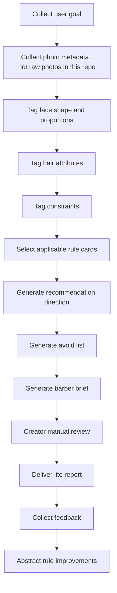

# Hairstyle Diagnosis Workflow

This workflow describes how creators can turn hairstyle consultation into a structured StyleOS-compatible process.

中文说明：
该流程帮助发型 / 造型 / 形象博主把发型咨询从“凭感觉回答”转成可复核、可交付、可沉淀的服务流程。

## Steps

1. Collect user goal.
2. Collect photo metadata, not raw photos in this repo.
3. Tag face shape and proportions.
4. Tag hair attributes.
5. Tag constraints.
6. Select applicable rule cards.
7. Generate recommendation direction.
8. Generate avoid list.
9. Generate barber brief.
10. Creator manual review.
11. Deliver lite report.
12. Collect feedback.
13. Abstract rule improvements.

## Public Repository Boundary

The public repository should only contain synthetic cases, abstracted rules, and fully anonymized authorized material. Raw photos, private intake forms, and private service notes must stay outside public GitHub content.
