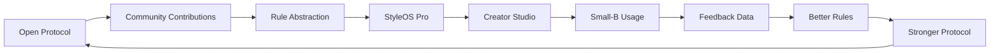

# Open-Core Growth Loop

StyleOS uses open protocol to grow adoption and commercial products to improve service delivery.

中文说明：
开放协议扩大共识，社区贡献带来规则素材，规则抽象进入更高质量的知识层，Creator Studio 承接小 B 使用，授权反馈再反哺更好的规则和标准。

## Loop Steps

### Open Protocol

The public repository defines schemas, rule cards, report templates, execution cards, and contribution rules.

### Community Contributions

Creators and developers contribute rule cards, schema suggestions, workflows, and synthetic examples.

### Rule Abstraction

Repeated creator observations are abstracted into reusable rules without personal data.

### StyleOS Pro

Reviewed, authorized, and higher-confidence patterns may become Pro library candidates under separate terms.

### Creator Studio

Hosted tools help creators use the protocol in real service workflows.

### Small-B Usage

Creators, studios, consultants, and small service teams use the workflow with fans or clients.

### Feedback Data

With consent and anonymization, feedback can improve rules, templates, and validation.

### Better Rules

Rules become clearer, safer, more actionable, and more scenario-aware.

### Stronger Protocol

The public standard improves, attracting more creators, developers, and small-B teams.

## Boundary

The public loop should never require raw personal photos or private fan records. Pro and hosted layers require separate authorization and commercial governance.
